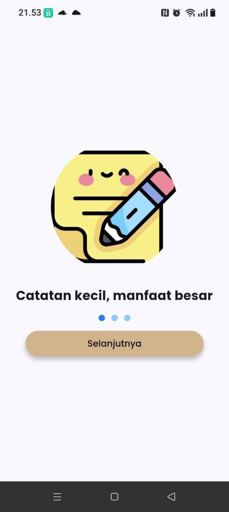
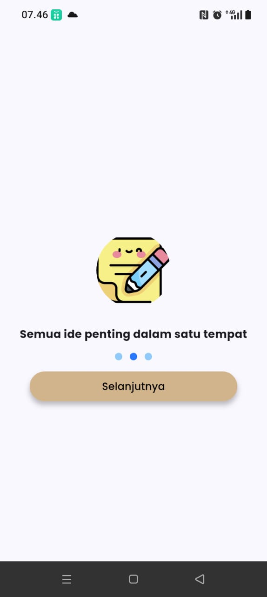
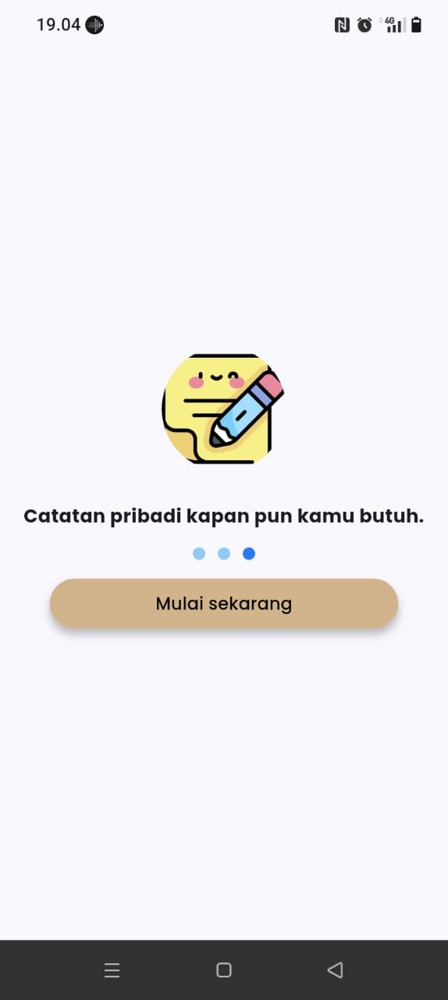
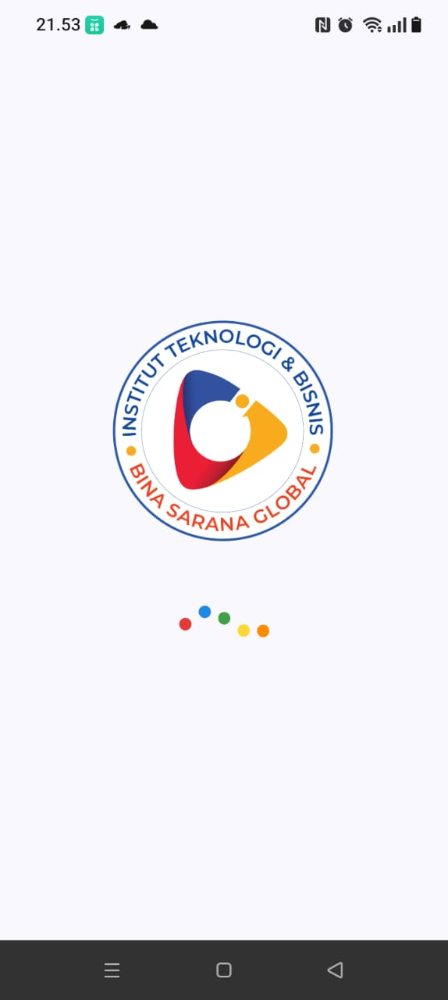
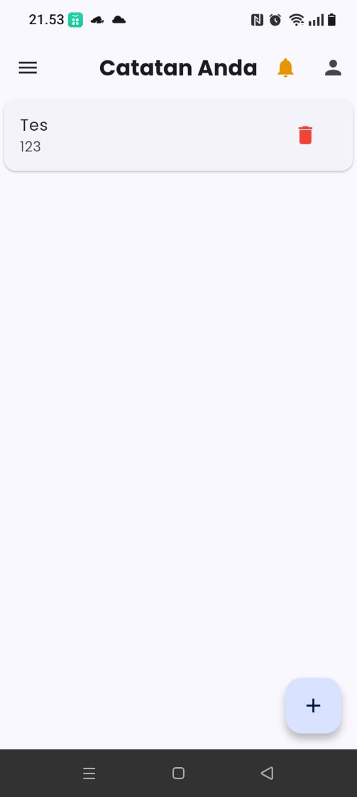
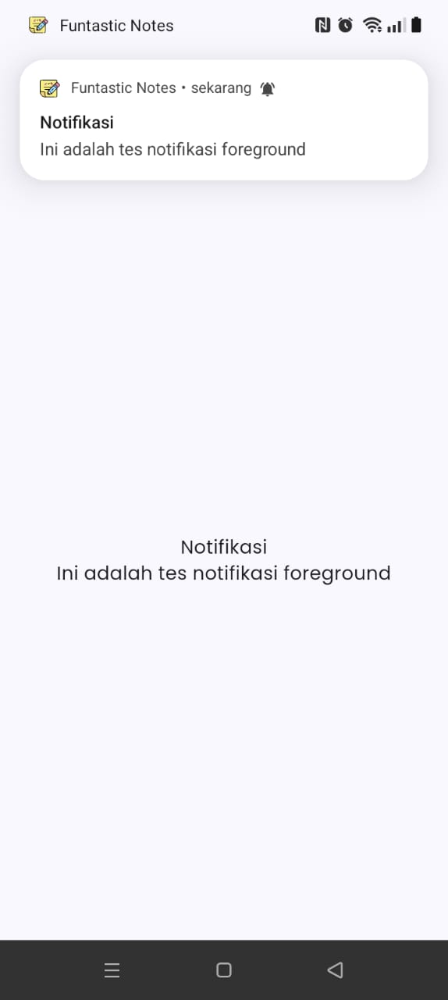
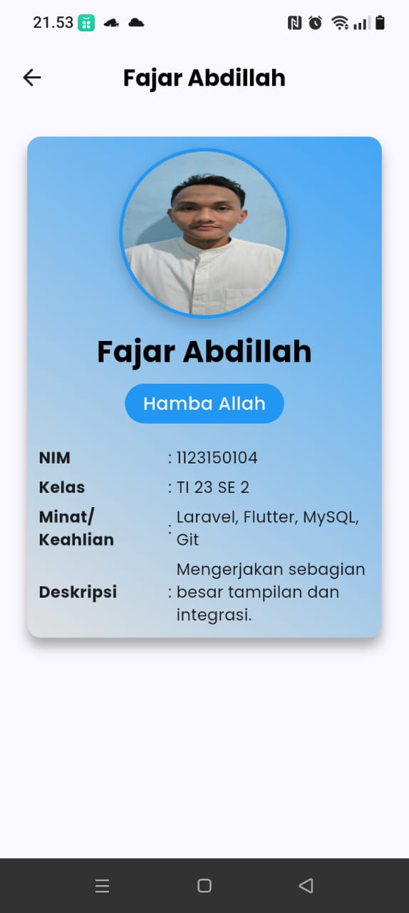
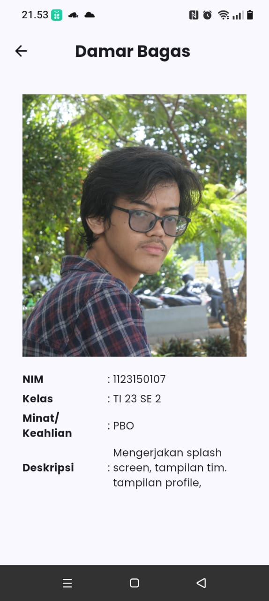
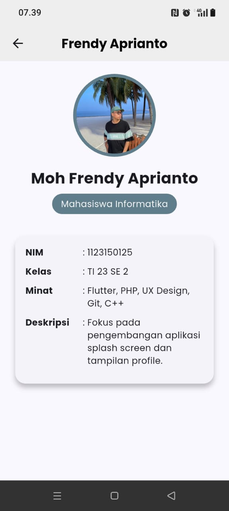
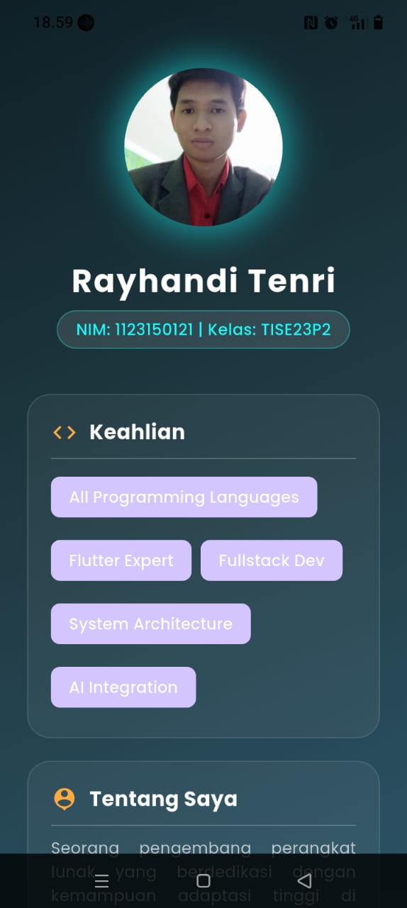

# Aplikasi Catatan Sederhana (Funtastic Notes)
Funtastic Note adalah aplikasi pencatatan sederhana yang dibuat khusus untuk mencatat dengan cara kerja yang mudah, ringan dan bermanfaat. Aplikasi ini menggunakan firebase untuk menangani proses login dan registrasi, memperbarui profile user, menerima notifikasi dan menggunakan supabase untuk menyimpan foto yang diupload oleh user. Sedangkan untuk setiap catatan yang dibuat oleh user, akan disimpan menggunakan database lokal yaitu SQLite.

## Informasi Kampus dan Mata Kuliah
Institut Teknologi dan Bisnis Bina Sarana Global atau Global Institute, adalah sebuah lembaga pendidikan yang berfokus untuk mengembangkan potensi mahasiswa atau mahasiswi yang sesuai dengan kebutuhan industri digital saat ini, salah satunya adalah potensi membangun dan mengembangkan perangkat lunak berbasis mobile melalui mata kuliah Pemrograman Aplikasi Mobile. Mata kuliah ini terdiri dari 3 SKS dan dibagi menjadi 2 tahap. Tahap pertama yaitu Pemrograman Aplikasi Mobile I, yang berfokus pada pembelajaran dan praktek dasar membangun dan mengembangkan aplikasi mobile menggunakan bahasa dart dan framework flutter hingga diharapkan untuk para mahasiswa/i mampu membangun dan mengembangkan aplikasi mobile sederhana yang juga bisa digunakan sebagai portofolio mahasiswa sebagai persiapan untuk memasuki dunia kerja di industri digital khususnya di bidang IT Mobile Programming. Kemudian tahap kedua, yaitu Pemrograman Aplikasi Mobile II, adalah tahap lanjutan yang juga berfokus pada pembelajaran dan praktek membangun dan mengembangkan aplikasi mobile dengan pengajaran dan materi yang lebih meningkat dari tahap dasar. 

## Anggota Tim Pengembang Aplikasi Funtastic Notes:
Aplikasi sederhana ini dikembangkan oleh kelompok Funtastic 4, yang terdiri dari 4 orang mahasiswa Global Institute, yaitu:
- Fajar Abdillah sebagai Team Leader dan Developer 1
  - Daftar Pekerjaan: 
    - Mengintegrasikan proyek flutter dengan Firebase dan Supabase untuk kebutuhan autentikasi (login, registrasi dan logout)   
    - Membuat splash screen, 
    - Membuat loading screen, 
    - Membuat fitur login, registrasi, dan logout, 
    - Membuat tampilan utama untuk aplikasi Funtastic Notes, 
    - Membuat proses tambah, lihat, update dan hapus catatan menggunakan sqlite,  
    - Membuat fitur pembaruan akun user, 
    - Membuat fitur terima notifikasi dari Firebase Cloud Message
    - Membuat halaman Informasi Pengembang
    - Membuat halaman profil Fajar Abdillah.
  - LinkedIn: - 
  - Skills: Flutter, Laravel, MySQL, Git, Github
- Muhammad Damar Bagas sebagai Developer 2
  - Daftar Pekerjaan: 
    - Membuat splash screen, 
    - Membuat halaman tim pengembang 
    - Membuat halaman profil Damar Bagas.
  - LinkedIn: -
  - Skills: Java, Git, Flutter, MySQL
- Moh. Frendy Aprianto sebagai Developer 3
  - Daftar Pekerjaan: 
    - Membuat splash screen, 
    - Membuat halaman profil Frendy Aprianto.
  - LinkedIn: https://www.linkedin.com/in/frendy-apr-145982102?utm_source=share&utm_campaign=share_via&utm_content=profile&utm_medium=android_app
  - Skills: Flutter, PHP, UI/UX Design, C++, Git
- Rayhandi Tenri sebagai Developer 4
  - Daftar Pekerjaan: 
    - Membuat splash screen, 
    - Membuat halaman profil Rayhandi Tenri
  - LinkedIn: -
  - Skills: Flutter

## Screenshots Aplikasi
Berikut tampilan hasil dari menjalankan aplikasi (diambil dari folder `screenshots`):

**Splash Screen 1**  

**Splash Screen 2**  

**Splash Screen 3**  

**Splash Screen 4**  

**Halaman Utama (Dashboard)**  

**Notifikasi (Foreground)**  

**Halaman Profil Fajar Abdillah**  

**Halaman Profil Damar Bagas**  

**Halaman Profil Frendy Aprianto**  

**Halaman Profil Rayhandi Tenri**  

## Link Youtube Presentasi

## Catatan Tambahan
- Aplikasi ini hanya dapat dijalankan di mobile Android dengan SDK flutter versi terbaru. Jalankan perintah flutter pub get di terminal terlebih dahulu agar bisa mendapatkan semua dependencies yang dibutuhkan di proyek ini.